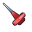

# 精修光标系列 · cursor-series

32×32 SVG 光标 12 款，沿用应用内精修光标（`dist/cursors/`）的质感路线：
多段渐变、棱面明暗、环境光遮蔽、`#1a1a2e` 深色压线；主体占满 3~29 格，四周留白防止边缘被裁。

本目录与 `dist/cursors/` 相互独立，**未接入应用**。总览画廊见仓库根目录 `cursor-series.html`。

| 预览 | 中文 | id | 分组 | 锚点 x y | 热点说明 | 画法要点 |
| :--: | --- | --- | --- | :--: | --- | --- |
|  | 放大镜 | `magnifier` | 工具 | **13 13** | 镜片中心 (13,13) | 金属镜圈多段反射 + 玻璃径向反光 + 手柄压线 |
|  | 板刷 | `brush` | 工具 | **4 4** | 刷毛尖端 (4,4) | 刷毛成束 + 金属箍反射 + 木杆棱面高光 |
|  | 剪刀 | `scissors` | 工具 | **4 4** | 上刀刃尖 (4,4) | 刀身分面 + 螺丝轴心 + 双环手柄互扣 |
|  | 直尺 | `ruler` | 工具 | **3 20** | 尺端左角 (3,20) | 半透明琥珀尺身 + 长短刻度 + 起点零刻度 |
|  | 图钉 | `pushpin` | 工具 | **4 4** | 针尖 (4,4) | 钢针压线 + 锥形针体 + 宽扁圆盘与背面凸台 |
|  | 书签 | `bookmark` | 工具 | **12 3** | 缎带左上角 (12,3) | 祖母绿缎面 + 暗色顶箍 + 烫金菱形徽记 |
|  | 火焰 | `flame` | 生活 | **16 3** | 火苗顶端 (16,3) | 三层火舌（外焰 / 内焰 / 焰心）+ 侧缘红光 |
|  | 闪电 | `lightning` | 生活 | **18 3** | 电芒顶端 (18,3) | 鎏金棱面 + 内芯亮带 + 边缘反光 |
|  | 经典箭头 | `arrow` | 标准 | **3 2** | 箭头尖端 (3,2) | 银灰箭身 + 尾翼分面 + 左缘高光 |
|  | 手型 | `hand` | 标准 | **14 3** | 食指指尖 (14,3) | 五指分节 + 指节缝 + 掌心受光 |
|  | 文本 I 形 | `ibeam` | 标准 | **16 4** | 竖杆顶端 (16,4) | 银白工字杆 + 中轴高光与暗边 |
|  | 四向移动 | `move` | 标准 | **16 16** | 图形中心 (16,16) | 四向箭头 + 中心握点 + 对角明暗 |

## 用法

自定义光标必须给出热点坐标，否则默认落在图片左上角：

```css
body.cursor-arrow,
body.cursor-arrow * {
  cursor: url('../cursors/arrow.svg') 3 2, auto !important;
}
```

- 浏览器 / Windows 对光标图片有 **32×32 上限**，超出部分会被裁掉，所以统一按 32×32 出图；
- 光标不支持 CSS 动画与滤镜外发光，全部光影靠静态图形表达；
- 路径为相对引用，按实际放置位置调整（放回应用时是 `../cursors/`）。

## 重新生成

```bash
node cursor-series/generate.mjs
```

元数据（id / 中文名 / 分组 / 锚点 / 热点说明 / 画法要点）与各款的图形片段都定义在生成器里；
一条命令会重建 `cursor-series/svg/*.svg`、仓库根目录 `cursor-series.html` 与本文件。
**不要手改这三处产物**——下次生成会被覆盖。

## 校验

```bash
node cursor-series/generate.mjs --check
```

只读不写，检查：每款 SVG 是否越出 32×32 画布（会被裁切）、锚点是否落在画布内、
画廊与 README 是否覆盖了全部 12 款、渐变 id 是否重复。
